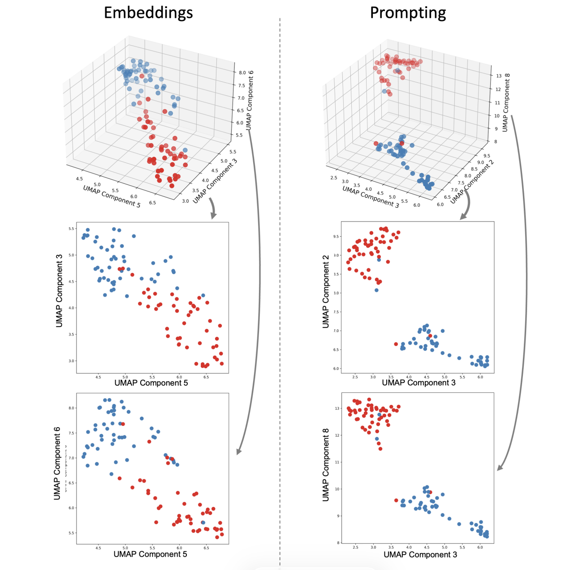

[Mapping 99 emotion terms](https://eijwat.github.io/Mapping-99-emotion-terms-with-GPT4-prompting-/)
---

# Mapping 99 emotion terms with GPT4 prompting reveals nuanced semantic conceptual structure

ACCESS THE PAPER

Ke, H., Watanabe, E.

Mapping 99 emotion terms with GPT4 prompting reveals nuanced semantic conceptual structure. 

Scientific Reports (2026).

[DOI](https://doi.org/10.1038/s41598-026-60536-4)

---

## Abstract

Dimensional theories of emotion propose that affective experiences can be organised along continuous dimensions like Pleasure, Arousal, and Dominance. Recent computational methods for capturing these conceptual structures have relied primarily on word embeddings, requiring substantial technical expertise. This study examined whether prompting GPT4 as a more accessible method, can capture this structure more effectively, by comparing both approaches against human spatial reasoning, with particular focus on analysing extensive emotion vocabularies exceeding constraints of human cognitive capability. Study 1 established validity by testing six basic emotions, prompting showed strong convergence with human judgements, while embeddings produced fundamentally different clustering patterns. Study 2 extended analysis to 99 emotion terms. Both approaches identified two optimal clusters distinguished by both Pleasure and Dominance, though prompting produced clearer cluster separation. Particularly, Arousal emerged only at the larger vocabulary scale as a secondary, component-level dimension rather than a cluster-defining one. Together these results indicated that GPT prompting offers a promising tool for investigating semantic structure of emotion, particularly in terms of uncovering patterns that only become visible when analysing a broader sample of emotion lexicon.

[Detailed introduction to the paper](https://eijwat.github.io/Mapping-99-emotion-terms-with-GPT4-prompting-/)

